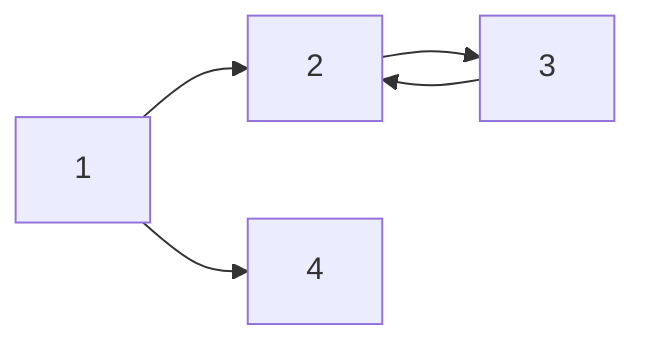

\#은 Header를 의미합니다.

# H1 태그 
`# H1 태그`

## H2 Tag
`## H2 Tag`

### H3 Tag
`### H3 Tag`

#### H4 Tag
`#### H4 Tag`


\#를 5개 이상 쓴다는 것? -> 잘못된 분류!!


---
`---`

_italic_
`_italic_`

**bold**
`**bold**`

**_italic+bold_**
`**_italic+bold_**`

~~hello~~
`~~hello~~`

> 안녕하세요 이건 Quote 입니다.
`> 안녕하세요 이건 Quote 입니다.`

--
`--`

## list
- list 1
- list 2
- list 3
    - A
        - B
``` markdown
- list 1
- list 2
- list 3
    - A
        - B
```

1. list 1
2. list 2
3. list 3
    1. A
        1. B
``` markdown
1. list 1
2. list 2
3. list 3
    1. A
        1. B
```

## 표
|제목|description|비고|
|-|-|-|
|안녕|1|2|
|할로|3|4|
``` markdown
|제목|description|비고|
|-|-|-|
|안녕|1|2|
|할로|3|4|
```


---
## 링크걸기
[kaen의 블로그]
(kaen7.github.io)


---

## simple code
``` markdown
``` javascript
function main(){
    printf("hello world");
    return 0;
}
```
```

---

$a^2 + b^2 = c^2

$$(\alpha + \beta)^2 = \alpha^2 + 2 \alpha \beta + \beta^2$$

---



[링크명](https://www.example.com), [링크명](https://www.example.com '사이트제목')